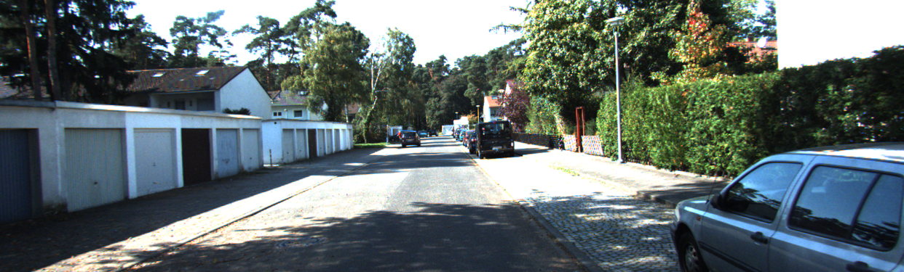
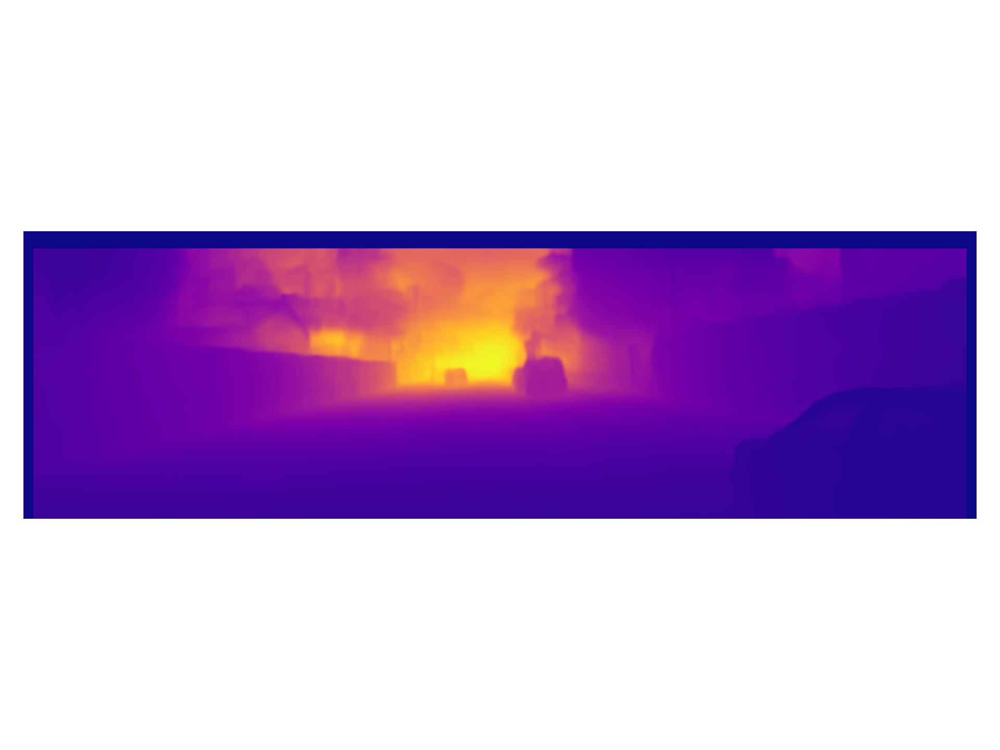

# SimpleDepthEstimation

## Introduction

This is an unified codebase for NN-based monocular depth estimation methods, the main framework is based on [detectron2](https://github.com/facebookresearch/detectron2) (with a lot of modifications) and supports both supervised and self-supervised monocular depth estimation methods. The main goal for developing this repository is to let me better understand popular depth estimation papers, so the code is written in a simple and easy to understand manner, it will be my pleasure if this repo helps you too.


## Environment:
1. clone this repo
   ```bash
   SDE_ROOT=/path/to/SimpleDepthEstimation
   git clone https://github.com/zzzxxxttt/SimpleDepthEstimation $SDE_ROOT
   cd $SDE_ROOT
   ```
2. create a new conda environment and activate it
   ```bash
   conda create -n sde python=3.6 
   conda activate sde
   ```
3. install torch==1.8.0 and torchvision==0.9.0 follow the [official instructions](https://pytorch.org/). (I haven't tried other pytorch versions)
4. install other requirements
   ```bash
   pip install -r requirements.txt
   ```


## Data preparation
### KITTI:
Download and extract [KITTI raw dataset](http://www.cvlibs.net/datasets/kitti/raw_data.php), [refined KITTI depth groundtruth](http://www.cvlibs.net/download.php?file=data_depth_annotated.zip), and [eigen split files](https://github.com/cleinc/bts/tree/master/train_test_inputs), then modify the data path in the config file.


## Training 
```bash
python path/to/project/train.py --num-gpus 2 --cfg path/to/config RUN_NAME run_name
```


## Evaluation
```bash
python path/to/project/train.py --num-gpus 2 --cfg path/to/config --eval MODEL.WEIGHTS /path/to/checkpoint_file
```


## Results:
### KITTI:
|         model          |      type       |                     config                      | abs rel err | sq rel err |  rms  | log rms |  d1   |  d2   |  d3   |
| :--------------------: | :-------------: | :---------------------------------------------: | :---------: | :--------: | :---: | :-----: | :---: | :---: | :---: |
|       ResNet-18        |   supervised    | [link](projects/Supervised/configs/resnet.yaml) |    0.076    |   0.306    | 3.066 |  0.116  | 0.936 | 0.990 | 0.998 |
|   [BTSNet](https://arxiv.org/abs/1907.10326) (ResNet-50)   |   supervised    |  [link](projects/Supervised/configs/bts.yaml)   |    0.062    |   0.259    | 2.859 |  0.100  | 0.950 | 0.992 | 0.998 |
| [MonoDepth2](https://arxiv.org/abs/1806.01260) (ResNet-18) | self-supervised | [link](projects/MonoDepth2/configs/resnet.yaml) |    0.118    |   0.735    | 4.517 |  0.163  | 0.860 | 0.974 | 0.994 |


## Demo:
```bash
python tools/demo.py --cfg path/to/config --input path/to/image --output path/to/output_dir MODEL.WEIGHTS /path/to/checkpoint_file
```

**Demo results:**





## Todo
- [ ] add [PackNet](https://arxiv.org/abs/1905.02693) implementation (I have added it, performance need verification)
- [ ] add [Dynamic Motion Learning](https://arxiv.org/abs/2010.16404) implementation (I have implemented it but still buggy, help welcome!)
- [ ] support more datasets

## Reference
- [detectron2](https://github.com/facebookresearch/detectron2)
- [monodepth2](https://github.com/nianticlabs/monodepth2)
- [bts](https://github.com/cleinc/bts)
- [packnet-sfm](https://github.com/TRI-ML/packnet-sfm)